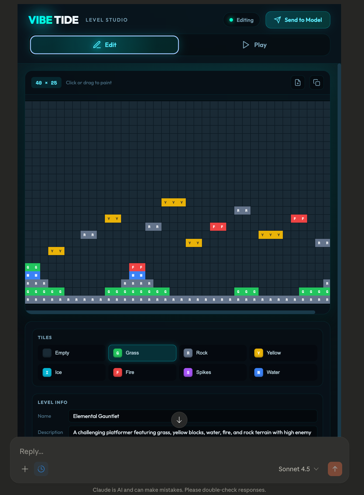

# Vibe Tide MCP App

Create, edit, and play Vibe Tide levels directly inside any MCP client that supports MCP Apps.



## Overview

Vibe Tide MCP App is an [MCP App](https://github.com/modelcontextprotocol/ext-apps) that brings a full level editor and game player into any MCP-compatible client. Ask Claude to design levels, and watch them appear in an interactive editor where you can tweak tiles, adjust gameplay parameters, and play-test instantly—all without leaving the conversation.

**Features:**
- Visual grid editor for painting tiles
- Embedded Unity WebGL player to test levels immediately
- Claude can create and modify levels through natural language
- No external URLs or browser tabs needed

## Getting Started

### Prerequisites
- Node.js 18+
- An MCP client with Apps support (e.g., Claude Desktop)

### Installation

1. Clone this repository and navigate to the app directory:
```bash
cd vibe_tide_mcp_app
npm install
npm run build
```

2. Add the server to your MCP client config. For Claude Desktop (`~/Library/Application Support/Claude/claude_desktop_config.json` on macOS):
```json
{
  "mcpServers": {
    "vibe-tide": {
      "command": "npx",
      "args": [
        "--silent",
        "tsx",
        "/path/to/vibe_tide_mcp_app/server.ts"
      ]
    }
  }
}
```

3. Restart your MCP client.

### Usage

Once configured, ask Claude to create a level:

> "Create a beach level with palm trees and water hazards"

The level editor will appear in the conversation. Use the tabs to:
- **Edit** — Click tiles to paint, adjust dimensions and game parameters
- **Play** — Test your level in the embedded Unity game

## Available Tools

| Tool | What it does |
|------|--------------|
| `create_level` | Generate a new level from a description |
| `decode_level_from_url` | Import a level from an encoded string |
| `edit_level_tile` | Change a single tile |
| `edit_level_row` | Replace an entire row |
| `edit_entire_level` | Replace the full tile grid |
| `edit_level_metadata` | Update name, description, and gameplay settings |
| `get_tile_reference` | Show the tile type legend |

## How It Works

The MCP App runs a local server that:
1. Exposes tools Claude can call to manipulate level data
2. Serves a React-based editor UI that renders in the MCP client
3. Hosts the Unity WebGL build for in-app play-testing

The Unity game loads via a blob URL technique that works within typical MCP client security constraints.

## Development

To run with hot-reload for UI development:
```bash
npm start
```

This starts the server on `http://localhost:3001/mcp` with watch mode. You can test with the [basic-host](https://github.com/modelcontextprotocol/ext-apps/tree/main/examples/basic-host) example from the MCP ext-apps repo.

## Learn More

- [MCP Apps Documentation](https://modelcontextprotocol.github.io/ext-apps/api/documents/Quickstart.html)
- [MCP Apps Repository](https://github.com/modelcontextprotocol/ext-apps)
